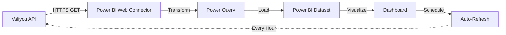

# Connect Valiyou to Power BI with API

**Build automated sponsorship dashboards in Power BI with live data from Valiyou API.** This guide covers API key creation, Power BI connector configuration, data transformation, and scheduled refresh setup for real-time sponsorship analytics.

<Note>
**Time Required**: 60-90 minutes (first-time setup)
**Prerequisites**: Microsoft Power BI Desktop installed, Professional/Enterprise Valiyou plan
**Permissions Required**: API permission or Admin access
**Technical Level**: Intermediate (basic Power Query knowledge helpful)
</Note>

## Why Power BI Integration?

**Benefits**:
- 📊 **Custom Dashboards**: Build sponsor-facing dashboards with your branding
- ⚡ **Real-Time Data**: Auto-refresh keeps dashboards current
- 📈 **Advanced Analytics**: Combine Valiyou data with other sources
- 🎯 **Self-Service**: Sponsors can explore data without asking for reports
- 💰 **Scalability**: One dashboard template for all sponsors

---

## Integration Architecture



---

## Part 1: Create API Key in Valiyou

**Navigate to Platform → API**

### Step 1: Create Read-Only API Key

1. Click **"Create API Key"** button
2. Fill in form:
   - **Key Name**: `Power BI Integration`
   - **Description**: `Read-only access for Power BI dashboards`
   - **Scopes**: Select what data you need
     - ☑ Valuations (for metrics)
     - ☑ Player Sales (if tracking transfers)
     - ☑ Clubs (for organization info)
   - **Operations**: ☑ GET only (read-only)

3. Click **"Create API Key"**
4. **IMPORTANT**: Copy API key immediately
   - Format: `vly_abc123def456...`
   - Store in password manager
   - You cannot view it again!

<Warning>
**Security**: Use header-based authentication (recommended) or query parameter. Never commit API keys to version control or share publicly.
</Warning>

**Related Documentation**: [API Keys Guide](/platform/api)

---

## Part 2: Configure Power BI Connection

### Step 1: Open Power BI Desktop

1. Launch **Power BI Desktop**
2. Click **Get Data** (Home ribbon)
3. Search for **"Web"**
4. Select **"Web"** connector
5. Click **Connect**

### Step 2: Enter API Endpoint URL

**Web Dialog Opens:**

1. Select **Advanced** option (not Basic)
2. Enter API endpoint in **URL parts**:

**For Valuations**:
```
https://valiyou.io/api/v1/valuations
```

3. Add **URL Parameters**:

**Option A: Header Authentication (Recommended)**:
- Skip URL parameters
- Click **OK**
- In next dialog, select **"Web API"** authentication
- Add custom header:
  - **Key**: `Authorization`
  - **Value**: `Bearer vly_YOUR_API_KEY_HERE`

**Option B: Query Parameter Authentication**:
- Add parameter: `club_id` = `YOUR_CLUB_ID`
- Add parameter: `api_key` = `vly_YOUR_API_KEY_HERE`
- Click **OK**

<Tip>
**Finding Club ID**: Your club ID is in Valiyou URL when logged in: `valiyou.io/dashboard?club=YOUR_CLUB_ID` or ask support for it.
</Tip>

### Step 3: Preview and Transform Data

**Power Query Editor Opens:**

1. You'll see JSON data preview
2. Click **"To Table"** button (Transform ribbon)
3. Click **"Expand"** icon (double arrows) next to `Column1` header
4. Select fields to include:
   - ☑ valuation_date
   - ☑ final_total_value
   - ☑ calculated_sales_value
   - ☑ calculated_media_value
   - ☑ tv_viewers
   - ☑ social_impressions
   - ☑ attendance
   - (select all fields you need)

5. Click **OK**

**Related Documentation**: [API Endpoints](/platform/api#api-endpoints)

---

## Part 3: Transform and Clean Data

### Step 1: Set Data Types

Power BI may not auto-detect types correctly:

1. For each numeric column:
   - Right-click column header
   - **Change Type** → **Decimal Number** (for valuations)
   - **Change Type** → **Whole Number** (for counts like viewers)

2. For date columns:
   - Right-click `valuation_date`
   - **Change Type** → **Date**

### Step 2: Rename Columns

Make column names user-friendly:

1. Double-click `final_total_value` header
2. Rename to: `Total Valuation`
3. Repeat for other columns:
   - `calculated_sales_value` → `Sales Value`
   - `calculated_media_value` → `Media Value`
   - `tv_viewers` → `TV Viewers`
   - `social_impressions` → `Social Impressions`

### Step 3: Add Calculated Columns

**Example: ROI Calculation**

1. Click **Add Column** ribbon
2. Click **Custom Column**
3. Enter formula:
```
= [Total Valuation] / 500000
```
(Replace 500000 with actual sponsor investment)

4. Name column: `ROI Multiple`
5. Click **OK**

**Example: Quarter Column**

1. Click **Add Column** ribbon → **Custom Column**
2. Enter formula:
```
= "Q" & Number.ToText(Date.QuarterOfYear([valuation_date]))
```
3. Name: `Quarter`
4. Click **OK**

---

## Part 4: Load Data to Power BI

1. Review all transformations in **Applied Steps** (right panel)
2. Click **Close & Apply** (Home ribbon)
3. Data loads into Power BI model
4. Wait for load to complete (status bar shows progress)

---

## Part 5: Create Visualizations

### Dashboard Layout Suggestions:

**Top Row - Key Metrics**:
- **Card**: Total Valuation (latest quarter)
- **Card**: Quarter-over-Quarter Growth %
- **Card**: Total Reach (sum of all impressions)
- **Card**: ROI Multiple

**Middle Row - Trends**:
- **Line Chart**: Valuation over time (X=Date, Y=Total Valuation)
- **Stacked Bar Chart**: Sales vs. Media Value by Quarter
- **Area Chart**: Social Impressions trend

**Bottom Row - Breakdown**:
- **Pie Chart**: Media Value by Channel
- **Table**: Detailed metrics by date
- **Gauge**: YoY Growth %

### Example: Create Valuation Trend Line Chart

1. Click **Line Chart** icon (Visualizations panel)
2. Drag fields:
   - **X-Axis**: `valuation_date`
   - **Y-Axis**: `Total Valuation`
   - **Legend**: `Quarter` (optional)
3. Format chart:
   - Click **Format** (paint brush icon)
   - Set title: "Sponsorship Valuation Trend"
   - Enable data labels
   - Adjust colors to match branding

### Example: Create Media Breakdown Pie Chart

1. Click **Pie Chart** icon
2. Drag fields:
   - **Values**: `Media Value`
   - **Legend**: Create calculated column for channel
3. Show percentages in labels

<Tip>
**Design Best Practice**: Use your brand colors for consistency. Go to View → Themes → Import Theme to add your brand palette.
</Tip>

---

## Part 6: Set Up Scheduled Refresh

### Option A: Power BI Service (Cloud)

1. Click **Publish** (Home ribbon)
2. Select workspace (or "My Workspace")
3. Click **Publish**
4. Open browser to [Power BI Service](https://app.powerbi.com)
5. Find your report in workspace
6. Click **⋯** (ellipsis) next to dataset
7. Select **Settings**
8. Configure **Scheduled refresh**:
   - **Frequency**: Daily or Hourly
   - **Time**: Set refresh times (e.g., 9 AM daily)
   - **Send failure notification**: Enable

9. Click **Apply**

<Warning>
**Gateway Required**: For on-premises Power BI, you need Power BI Gateway installed. Cloud users can refresh directly.
</Warning>

### Option B: Manual Refresh

1. In Power BI Desktop: Click **Refresh** (Home ribbon)
2. Data updates from API
3. Republish to Power BI Service
4. Share updated dashboard

---

## Part 7: Share Dashboard with Sponsors

### Method 1: Embed in Web Page

1. Publish dashboard to Power BI Service
2. Click **File** → **Embed** → **Publish to Web**
3. Copy embed code
4. Add to sponsor portal website
5. Dashboard updates automatically with scheduled refresh

### Method 2: Direct Share Link

1. In Power BI Service, open dashboard
2. Click **Share** button (top right)
3. Enter sponsor email addresses
4. Set permissions:
   - ☑ Allow recipients to view (read-only)
   - ☐ Don't allow resharing
5. Click **Share**

Sponsor receives email with dashboard link.

### Method 3: Export PDF

1. Open dashboard in Power BI Service
2. Click **File** → **Export** → **PDF**
3. PDF downloads with current data
4. Email to sponsor

<Info>
**Access Control**: Power BI Pro license required for each viewer. Alternatively, use Power BI Embedded or Premium capacity for external sharing without viewer licenses.
</Info>

---

## Advanced Tips

### Combine Multiple Endpoints

**Add Player Sales Data**:

1. In Power Query, click **New Source** → **Web**
2. Enter URL: `https://valiyou.io/api/v1/player-sales?api_key=...&club_id=...`
3. Transform and load
4. Create relationships between tables:
   - **Valuations** table: `valuation_id`
   - **Player Sales** table: `valuation_id`
5. Build cross-table visuals

### Parameter for Club ID

**Make dashboard reusable for multiple clubs**:

1. In Power Query: **Manage Parameters**
2. Create new parameter:
   - **Name**: `ClubID`
   - **Type**: Text
   - **Current Value**: `your-club-id`
3. Reference in API URL:
   ```
   = "https://valiyou.io/api/v1/valuations?club_id=" & ClubID & "&api_key=..."
   ```
4. Duplicate dashboard, change parameter for different club

### Add Benchmarks

**Show industry averages**:

1. Create manual table with benchmark data
2. Enter data → New Table
3. Input:
   ```
   Benchmarks = DATATABLE(
       "Metric", STRING,
       "Benchmark", DECIMAL,
       {
           {"TV CPM", 30},
           {"Social Impressions", 10000000},
           {"Attendance", 75000}
       }
   )
   ```
4. Use in visuals to compare actual vs. benchmark

---

## Troubleshooting

<AccordionGroup>
  <Accordion title="401 Unauthorized Error">
    **Cause**: Invalid API key or incorrect authentication

    **Fix**:
    1. Verify API key is active in Valiyou (Platform → API)
    2. Check key hasn't been revoked
    3. Ensure no extra spaces in key when pasting
    4. Confirm club_id is correct
  </Accordion>

  <Accordion title="Empty Dataset / No Data Returned">
    **Cause**: Filters too restrictive or no valuations exist

    **Fix**:
    1. Remove date filters from API URL
    2. Verify valuations exist in Valiyou
    3. Test API URL in browser first
    4. Check API endpoint is correct (.io not .com)
  </Accordion>

  <Accordion title="Refresh Fails in Power BI Service">
    **Cause**: API key in query parameter, or gateway issue

    **Fix**:
    1. Use header-based auth instead of query param
    2. For on-premises: Install Power BI Gateway
    3. Check data source credentials in Power BI Service settings
    4. Verify firewall allows outbound HTTPS to valiyou.io
  </Accordion>

  <Accordion title="Data Types Show as Text">
    **Cause**: Power BI auto-detected wrong type

    **Fix**:
    1. In Power Query, change type for each column
    2. Numeric columns → Decimal Number or Whole Number
    3. Date columns → Date
    4. Close & Apply
  </Accordion>
</AccordionGroup>

---

## Dashboard Examples

**Sponsor Quarterly Review Dashboard**:
- KPIs: Total Valuation, ROI, Reach
- Trend: Valuation line chart (quarterly)
- Breakdown: Media channels pie chart
- Table: Detailed metrics

**Executive Summary Dashboard**:
- Cards: Current quarter valuation
- Gauge: YoY growth %
- Map: Geographic reach (if data available)
- Waterfall: Sales + Media = Total

**Social Media Performance Dashboard**:
- Line: Impressions trend
- Bar: Engagement by platform
- Table: Top posts (requires social API integration)

---

## Next Steps

<CardGroup cols={2}>
  <Card title="Automate Reports" icon="calendar-check" href="/guides/quarterly-sponsor-report">
    Use Power BI dashboards for quarterly sponsor reports
  </Card>

  <Card title="Advanced Analytics" icon="chart-mixed">
    Combine with Google Analytics, CRM data for attribution modeling
  </Card>

  <Card title="API Documentation" icon="code" href="/platform/api">
    Explore all available API endpoints and parameters
  </Card>

  <Card title="Custom Calculations" icon="calculator">
    Build DAX measures for complex KPIs (ROAS, engagement rate, etc.)
  </Card>
</CardGroup>

---

## Related Guides

- **[Quarterly Sponsor Report](/guides/quarterly-sponsor-report)** - Manual reporting process
- **[API Keys Management](/platform/api)** - Full API documentation
- **[Close First Sponsorship](/guides/close-first-sponsorship)** - End-to-end deal flow

---

## Need Help?

<Card title="Contact Support" icon="headset">
  **Email**: support@valiyou.com

  Our team can help with Power BI connector issues, DAX formulas, and dashboard design best practices.
</Card>

<Card title="Power BI Community" icon="users">
  **Forum**: [community.powerbi.com](https://community.powerbi.com)

  For Power BI-specific questions (not Valiyou API issues)
</Card>
