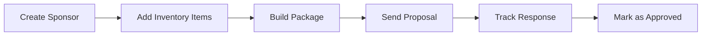

# Close Your First Sponsorship Deal

**Complete end-to-end workflow for securing your first sponsorship using Valiyou.** This guide walks you through every step from initial contact to signed agreement, connecting sponsors, inventory, packages, and proposals.

<Note>
**Time Required**: 30-45 minutes (first-time setup)
**Plan Required**: Professional or Enterprise plan
**Permissions Required**: Sponsors, Inventory, Packages, and Proposals permissions
</Note>

## Workflow Overview

## Step 1: Create Your Sponsor Profile

**Navigate to Sponsorships → Sponsors**

1. Click **"Create Sponsor"** button (top right)
2. Fill in sponsor details:
   - **Company Name**: Full legal name
   - **Contact Person**: Primary decision-maker
   - **Email**: Where proposal will be sent
   - **Phone**: Optional but recommended
   - **Tier**: Select tier (Platinum, Gold, Silver, Bronze)
   - **Status**: Set to "Prospective" or "In Negotiation"
3. Click **"Save"**

<Tip>
**Pro Tip**: Add notes about sponsor preferences, past conversations, or specific interests. This helps customize your proposal later.
</Tip>

**Related Documentation**: [Sponsors Guide](/sponsorships/sponsors)

---

## Step 2: Set Up Your Inventory

**Navigate to Sponsorships → Inventory**

Add the sponsorship assets you'll include in your package:

### Common Inventory Items:

**Logo Placement**:
- Jersey front logo
- Stadium signage
- Website placement
- Social media mentions

**VIP Benefits**:
- Match tickets (quantity)
- Hospitality suite access
- Player meet-and-greet

**Digital Assets**:
- Social media posts (quantity)
- Newsletter mentions
- Website banner ads

### Adding Items:

1. Click **"Add Item"** button
2. Enter item details:
   - **Name**: Clear description (e.g., "Jersey Front Logo - Large")
   - **Category**: Assign to category (Logo, Digital, Hospitality)
   - **Quantity**: How many available (e.g., 500 jersey placements for season)
   - **Cost**: Your internal cost (optional, for margin calculation)
3. Click **"Save"**
4. Repeat for all assets

<Info>
**Inventory Strategy**: Start with 10-15 core items. You can always add more later. Focus on high-value, high-visibility assets first.
</Info>

**Related Documentation**: [Inventory Guide](/sponsorships/inventory/inventory)

---

## Step 3: Build Your Sponsorship Package

**Navigate to Sponsorships → Packages**

1. Click **"Create Package"** button
2. Fill in package basics:
   - **Package Name**: Descriptive name (e.g., "Gold Partner Q1 2025")
   - **Sponsor**: Select the sponsor you created
   - **Tier**: Confirm tier (auto-filled from sponsor)
   - **Events**: Select relevant events/seasons

### Add Items to Package:

3. Click **"Add Items"** in the Package Builder
4. Select items from your inventory:
   - Jersey front logo (1x)
   - Stadium signage (2x locations)
   - Match tickets (20x per game)
   - Social media posts (10x)
5. For each item, set:
   - **Quantity**: How many included
   - **Coverage %**: Visibility percentage (optional, for valuation)
   - **Price**: Value for this item in package

### Use Negotiator Mode (Optional):

6. Toggle **"Negotiator Mode"** if you want cost-plus pricing:
   - Set margin % you want (e.g., 40%)
   - System calculates recommended pricing automatically
   - Adjust coverage % to see value impact

7. Review package totals:
   - **Total Value**: Sum of all items
   - **Total Cost**: Your costs (if entered)
   - **Margin**: Profit percentage

8. Click **"Save Package"**

<Warning>
**Don't Send Yet**: Save as draft first. Review with your team before sending to sponsor.
</Warning>

**Related Documentation**:
- [Packages Guide](/sponsorships/packages)
- [Negotiator Mode](/sponsorships/inventory/negotiator)

---

## Step 4: Send Proposal to Sponsor

**From Packages page:**

1. Find your package in the list
2. Click **three-dot menu** (⋯) → **"Send Proposal"**
3. Proposal sending modal opens:
   - **Recipient Email**: Confirm sponsor contact email
   - **Subject Line**: Customize (e.g., "Partnership Proposal - Gold Tier")
   - **Message**: Add personalized intro message
   - **Due Date**: Set response deadline (optional)

4. Preview proposal:
   - Click **"Preview"** to see what sponsor will receive
   - Check formatting, pricing, item list

5. Click **"Send Proposal"**

### What Happens Next:

- ✅ Sponsor receives email with proposal link
- ✅ Package moves from **Packages** to **Proposals** page
- ✅ Status changes to "Sent"
- ✅ You can track when sponsor opens proposal

<Tip>
**Follow Up**: Send a personal email or call 2-3 days after sending to answer questions and gauge interest.
</Tip>

**Related Documentation**: [Proposals Guide](/sponsorships/proposals)

---

## Step 5: Track Proposal Status

**Navigate to Sponsorships → Proposals**

Monitor your sent proposal:

1. Find proposal in list
2. Check **Status** column:
   - **Sent**: Waiting for sponsor response
   - **Viewed**: Sponsor opened the proposal (engagement indicator)
   - **Approved**: Sponsor accepted ✅
   - **Rejected**: Sponsor declined ❌

3. Click on proposal to view details:
   - **Timeline**: See when sent, viewed, responded
   - **Comments**: Sponsor can leave feedback
   - **Activity Log**: Full history

### When Sponsor Responds:

**If Approved**:
- Status automatically updates to "Approved"
- You receive notification
- Move to Step 6 (finalize agreement)

**If Rejected**:
- Status updates to "Rejected"
- Review sponsor comments for feedback
- Consider creating revised package

**If No Response**:
- Follow up after 5-7 days
- Check if sponsor viewed proposal
- Offer to schedule call to discuss

---

## Step 6: Mark Deal as Closed

Once sponsor verbally confirms or signs agreement:

1. Open the approved proposal
2. Click **"Mark as Won"** button
3. Enter final details:
   - **Signed Date**: When agreement was finalized
   - **Contract Value**: Final negotiated amount (if different from proposal)
   - **Contract Start/End**: Duration of sponsorship
   - **Payment Terms**: When sponsor will pay

4. Click **"Save"**

### Post-Closure Actions:

<CardGroup cols={2}>
  <Card title="Update Sponsor Status" icon="user-check">
    Change sponsor status from "In Negotiation" to "Active Partner"
  </Card>

  <Card title="Send Contract" icon="file-contract">
    Send formal contract outside of Valiyou (DocuSign, email, etc.)
  </Card>

  <Card title="Schedule Kickoff" icon="calendar">
    Set up kickoff call with sponsor to plan activation
  </Card>

  <Card title="Track Deliverables" icon="list-check">
    Create internal checklist for fulfilling package items
  </Card>
</CardGroup>

---

## Common Pitfalls to Avoid

<AccordionGroup>
  <Accordion title="Sending unreviewed proposals">
    **Problem**: Rushing to send without internal review

    **Solution**: Save as draft, review with team, then send. Check pricing, item quantities, and grammar carefully.
  </Accordion>

  <Accordion title="Vague package items">
    **Problem**: Items like "Social media" without specifics

    **Solution**: Be specific - "10 Instagram posts, 5 LinkedIn posts, 2 YouTube mentions." Sponsors need clarity.
  </Accordion>

  <Accordion title="Not following up">
    **Problem**: Sending proposal and waiting silently

    **Solution**: Follow up 2-3 days after sending. Most deals close after multiple touchpoints, not after first proposal.
  </Accordion>

  <Accordion title="Overcomplicating first package">
    **Problem**: Including 50+ items in first package

    **Solution**: Start with 5-10 high-impact items. You can always upsell additional benefits later.
  </Accordion>
</AccordionGroup>

---

## Success Checklist

Before sending your first proposal, verify:

- [ ] Sponsor profile complete with accurate contact info
- [ ] Inventory items clearly named and categorized
- [ ] Package pricing reviewed by team
- [ ] Proposal email personalized (not generic)
- [ ] Follow-up plan scheduled (calendar reminder)
- [ ] Internal team knows proposal is out
- [ ] Contract template ready for when approved

---

## Next Steps After First Deal

<CardGroup cols={2}>
  <Card title="Create More Packages" icon="box" href="/sponsorships/packages">
    Package successful items into tier templates for future sponsors
  </Card>

  <Card title="Track Performance" icon="chart-line" href="/valuations/create-valuation">
    Create valuations to measure delivered value vs. promised value
  </Card>

  <Card title="Upsell Existing Sponsors" icon="arrow-trend-up" href="/sponsorships/proposals">
    Send add-on packages to active sponsors mid-season
  </Card>

  <Card title="Build Proposal Library" icon="folder" href="/sponsorships/packages">
    Save successful packages as templates for faster future proposals
  </Card>
</CardGroup>

---

## Related Guides

- **[Quarterly Sponsor Report](/guides/quarterly-sponsor-report)** - Show ROI to sponsors
- **[Import CRM to Proposals](/guides/import-crm-to-proposals)** - Migrate existing sponsors
- **[API Power BI Integration](/guides/api-powerbi-integration)** - Build sponsor dashboards

---

## Need Help?

<Card title="Contact Support" icon="headset">
  **Email**: support@valiyou.com

  Our team can help with package strategy, pricing guidance, and proposal best practices.
</Card>
