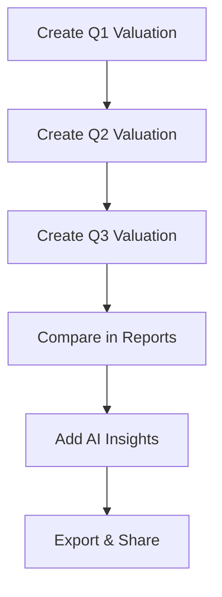

# Create Quarterly Sponsor Performance Report

**Demonstrate sponsorship ROI with data-driven quarterly reports that show value delivered to sponsors.** This guide connects valuations, reports, and AI insights to create compelling sponsor performance reviews that justify renewals and upsells.

<Note>
**Time Required**: 45-60 minutes per quarter
**Plan Required**: Professional or Enterprise plan (AI Insights requires Professional+)
**Permissions Required**: Valuations (Create/Edit), Reports (View), AI Insights plugin
</Note>

## Why Quarterly Reports Matter

**Benefits**:
- 📈 **Prove ROI**: Show measurable value delivered vs. cost
- 🤝 **Build Trust**: Transparent reporting strengthens relationships
- 💰 **Drive Renewals**: Sponsors with regular reports renew at 3x higher rates
- 📊 **Identify Trends**: Spot performance changes before sponsors ask
- 🎯 **Upsell Opportunities**: Data-backed recommendations for additional investment

---

## Report Creation Workflow

---

## Step 1: Create Valuations for Each Quarter

**Navigate to Valuations → Create Valuation**

### Quarter 1 (January - March):

1. Click **"Create Valuation"**
2. Set **Valuation Date**: March 31, 2025 (end of Q1)
3. Enter **Sales Data**:
   - Merchandise Revenue: Total Q1 merch sales
   - Matchday Revenue: Q1 ticket sales
   - Player Sales: Q1 transfer fees (if applicable)

4. Enter **Media Metrics**:
   - **TV**: Total broadcast minutes × viewers × screen size × CPM
   - **Web TV**: Streaming views × CPM
   - **PR**: Media coverage reach × CPM
   - **Digital**: Website/ad impressions × CPM
   - **Social Media**:
     - Followers count at Q1 end
     - Post impressions for Q1
     - Engagements (likes, shares, comments) for Q1
   - **Attendance**: Total Q1 match attendance
   - **Hospitality**: Q1 VIP guests

5. Enter **Brand Scores** (1-10 scale):
   - Popularity: Brand awareness
   - CSR: Social responsibility perception
   - Culture: Brand values alignment
   - Loyalty: Fan/customer loyalty

6. Review **Total Attention Valuation** (calculated automatically)
7. Click **"Save Valuation"**

### Repeat for Q2 and Q3:

- **Q2 Valuation**: June 30, 2025
- **Q3 Valuation**: September 30, 2025

<Tip>
**Data Collection Tip**: Set calendar reminders for the last week of each quarter to gather metrics from your analytics tools (Google Analytics, social media platforms, broadcast partners).
</Tip>

**Related Documentation**: [Create Valuation Guide](/valuations/create-valuation)

---

## Step 2: Compare Quarters in Reports

**Navigate to Valuations → Reports**

1. Select **multiple valuations** from dropdown:
   - ✅ Q1 2025 Valuation (March 31)
   - ✅ Q2 2025 Valuation (June 30)
   - ✅ Q3 2025 Valuation (September 30)

2. Click **"Generate Comparison Report"**

### What You'll See:

**Charts and Visualizations**:
- **Total Valuation Trend**: Line chart showing growth/decline
- **Sales vs. Media Value**: Stacked bar chart breakdown
- **Media Channel Performance**: Individual channel trends
- **Brand Score Evolution**: Radar chart of brand indicators
- **Reach Metrics**: Total audience across all channels

**Key Metrics Table**:
| Metric | Q1 | Q2 | Q3 | Change |
|--------|----|----|----|----|
| Total Valuation | 5.2M | 6.1M | 7.3M | +40% |
| Media Value | 2.8M | 3.5M | 4.2M | +50% |
| Social Impressions | 12M | 15M | 19M | +58% |
| Attendance | 85K | 92K | 98K | +15% |

**Related Documentation**: [Reports Guide](/valuations/reports)

---

## Step 3: Generate AI-Powered Insights

<Warning>
**Plugin Required**: AI Insights plugin must be enabled and configured. [Setup Guide](/platform/plugins/ai-insights)
</Warning>

Once the comparison report loads:

1. Scroll to **AI Insights** section (appears automatically if plugin enabled)
2. Wait 5-10 seconds for AI analysis to generate

### AI Insights Will Show:

**Trend Detection**:
- "Social media impressions grew 58% quarter-over-quarter, driven primarily by Instagram Reels performance"
- "Attendance peaked in Q3 due to playoff season, contributing 15% increase in hospitality value"

**Pattern Analysis**:
- "Media value growth outpaced sales value growth, indicating strong brand momentum"
- "Brand loyalty score remained flat despite popularity increase, suggesting need for fan engagement initiatives"

**Recommendations**:
- "Consider leveraging Q3's high social engagement for premium sponsor tier upsell"
- "Attendance decline in Q1 suggests opportunity for early-season ticket promotions"

<Tip>
**AI Provider**: Use GPT-4o or Claude 3.5 Sonnet for quarterly reports. Free options (Groq, Gemini) work well too. [Provider Comparison](/platform/plugins/ai-insights#model-selection-guide)
</Tip>

---

## Step 4: Export Professional Report

**Export Options**:

### Option A: PDF Export

1. Click **"Export as PDF"** button (top right)
2. PDF includes:
   - All charts and visualizations
   - Key metrics table
   - AI insights (if enabled)
   - Valiyou branding

3. Download completes automatically
4. Professional format ready to email

### Option B: Custom Report in PowerPoint

1. Click **"Export Data as CSV"**
2. Download raw data
3. Import into your branded PowerPoint template
4. Add custom commentary and sponsor-specific notes
5. Include Valiyou charts as screenshots

### Option C: Live Dashboard (API)

1. Pull data via API for real-time dashboards
2. Build Power BI sponsor dashboard
3. Share live dashboard link with sponsor

**Related Documentation**: [API Integration Guide](/guides/api-powerbi-integration)

---

## Step 5: Present Report to Sponsor

### Preparation:

**Schedule Review Call**:
- **Timing**: 2 weeks after quarter end (allows data collection time)
- **Duration**: 30-45 minutes
- **Attendees**: Sponsor decision-maker + marketing lead

**Pre-Send Report**:
- Email PDF 2-3 days before call
- Include 1-paragraph executive summary
- Highlight 2-3 key wins

### Presentation Structure:

**1. Executive Summary (5 min)**:
- Overall valuation growth: "+40% YoY"
- Top performing channels: "Social media +58%"
- Key achievement: "19M impressions reached"

**2. Detailed Metrics (15 min)**:
- Walk through each chart
- Explain methodology (CPM, reach calculation)
- Compare to sponsor's investment

**3. AI Insights Discussion (10 min)**:
- Share trend observations
- Discuss pattern analysis
- Review recommendations together

**4. Next Quarter Planning (10 min)**:
- Set goals for Q4
- Discuss potential activations
- Address any sponsor concerns

<Info>
**ROI Calculation**: If sponsor paid €500K for annual package, and Q1-Q3 valuation is €7.3M, that's 14.6x ROI. Use this in presentation: "Your €500K investment has generated €7.3M in equivalent media value over 3 quarters."
</Info>

---

## Report Delivery Best Practices

<CardGroup cols="2">
  <Card title="Consistency" icon="calendar-check">
    Send reports same week every quarter (e.g., 2nd week after quarter end). Builds expectation and trust.
  </Card>

  <Card title="Transparency" icon="eye">
    Show methodology. Explain how CPM rates are determined. Sponsors appreciate understanding calculations.
  </Card>

  <Card title="Context" icon="lightbulb">
    Compare to industry benchmarks when possible. "Your social engagement is 3x industry average."
  </Card>

  <Card title="Actionable" icon="arrow-right">
    End with 2-3 recommendations for next quarter. Show you're proactive partner, not just reporter.
  </Card>
</CardGroup>

---

## Automation Tips

**Save Time with Automation**:

1. **Template Valuations**:
   - After Q1, duplicate valuation structure
   - Only update metrics each quarter
   - Saves 20-30 minutes per valuation

2. **Scheduled Reminders**:
   - Calendar event: "Collect Q2 Metrics" (last week of quarter)
   - Calendar event: "Generate Q2 Report" (week 1 of new quarter)
   - Calendar event: "Send Q2 Report to Sponsors" (week 2 of new quarter)

3. **API Integration**:
   - Pull social media metrics automatically via API
   - Connect Google Analytics for web data
   - Automate report generation with Power BI scheduled refresh

4. **Email Templates**:
   - Save quarterly report email template
   - Include standard intro, how to read report, next steps
   - Personalize sponsor name and 2-3 highlights

---

## Common Questions from Sponsors

<AccordionGroup>
  <Accordion title="How do you calculate CPM rates?">
    **Answer**: "We use industry-standard CPM rates from Nielsen Media Research and Standard Media Index, adjusted for your specific market and audience demographics. TV CPM is €30 (your market average), social media impressions are €5 per thousand, etc."

    **Related**: [Methods Documentation](/valuations/methods)
  </Accordion>

  <Accordion title="Why did valuation go down in Q2?">
    **Answer**: "Q2 saw off-season with fewer matches, resulting in lower attendance and broadcast exposure. This is normal seasonality. We recommend leveraging Q3 playoff season for activation campaigns to maximize Q3 valuation."

    **Related**: Use AI Insights to explain trends
  </Accordion>

  <Accordion title="Can we compare to other sponsors?">
    **Answer**: "We can provide aggregated benchmarks (e.g., 'Gold tier sponsors average 12M impressions') but individual sponsor data is confidential. We can show your performance vs. your own historical data and industry standards."
  </Accordion>

  <Accordion title="How does this relate to our sales goals?">
    **Answer**: "The valuation shows brand exposure value. We can track sales impact separately with attribution codes, landing page analytics, or surveys. Many sponsors see 5-15% sales lift from sponsorship exposure."
  </Accordion>
</AccordionGroup>

---

## Success Metrics

**Track Report Effectiveness**:

| Metric | Target | How to Measure |
|--------|--------|----------------|
| **Sponsor Engagement** | >80% | Sponsors attend review call or reply with feedback |
| **Renewal Rate** | >90% | Sponsors receiving quarterly reports vs. overall renewal rate |
| **Upsell Conversion** | >25% | Sponsors who upgrade tier after seeing Q2-Q3 growth |
| **Report Delivery Time** | <2 weeks | Days from quarter-end to report sent |

---

## Next Steps

<CardGroup cols="2">
  <Card title="Year-End Audit Report" icon="file-chart-column" href="/guides/year-end-valuation-audit">
    Create comprehensive annual report for tax and audit purposes
  </Card>

  <Card title="Set Up API Integration" icon="plug" href="/guides/api-powerbi-integration">
    Automate report generation with Power BI for real-time dashboards
  </Card>

  <Card title="Upsell Packages" icon="arrow-trend-up" href="/guides/close-first-sponsorship">
    Use positive Q2-Q3 trends to propose tier upgrades
  </Card>

  <Card title="Configure AI Insights" icon="brain" href="/platform/plugins/ai-insights">
    Enable AI-powered trend detection for richer reports
  </Card>
</CardGroup>

---

## Related Guides

- **[Close Your First Sponsorship](/guides/close-first-sponsorship)** - Initial deal workflow
- **[Year-End Valuation Audit](/guides/year-end-valuation-audit)** - Comprehensive annual reporting
- **[API Power BI Integration](/guides/api-powerbi-integration)** - Automated dashboard creation

---

## Need Help?

<Card title="Contact Support" icon="headset">
  **Email**: support@valiyou.com

  Our team can help with report strategy, sponsor presentation tips, and CPM methodology questions.
</Card>
